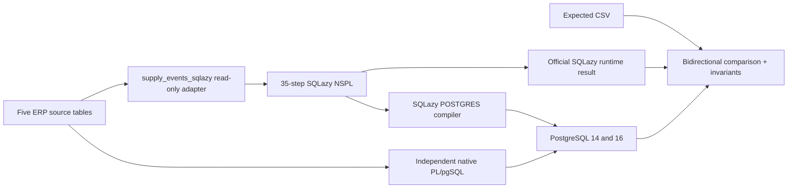

# SQLazy ERP Allocation POC

A reproducible, evidence-driven ERP allocation case study built from the full five-table challenge—not a toy balance query.

It models time-phased demand and supply across materials and warehouses, executes the workflow in the official SQLazy web app, captures SQLazy's real PostgreSQL compiler output, and compares both against an independent native PostgreSQL implementation.

## Verified status

| Check | Result |
|---|---|
| Current SQLazy web runtime | 35/35 steps executed; 7/7 expected rows matched |
| Current SQLazy POSTGRES compiler | Captured; 772 lines / 20 CTEs including the view wrapper |
| Independent native reference | 7/7 expected rows matched |
| PostgreSQL 14.18 | Base case + 6 edge scenarios passed |
| PostgreSQL 16.14 | Base case + 6 edge scenarios passed |
| Deprecated conditional aggregate syntax | 0 occurrences; enforced by CI |
| Conservation invariant | Passed on every row |
| Total base shortage | 25 |
| Multi-stream isolation | Passed |
| Priority/date reversal | Passed without negative or reused supply |

The captured web result, expected CSV, compiled SQL, and native output are compared bidirectionally by the test harness.

## Tested against current SQLazy syntax — 2026-08-27

- Current SQLazy syntax: **PASS**, with the documented trailing-condition binding workaround.
- Main ERP scenario: **PASS**.
- Seven expected rows: **MATCH**.
- Six edge scenarios: **PASS**.
- PostgreSQL 14.18: **PASS**.
- PostgreSQL 16.14: **PASS**.
- Independent native reference: **MATCH** and unchanged.
- Current and legacy compiler SQL: **CAPTURED SEPARATELY**.
- Deprecated prefix-condition syntax remaining: **0**.

The current web release accepts the new trailing form, but its runtime/compiler presently applies each condition to the following aggregate rather than the preceding aggregate described in the product note. The POC keeps the new syntax and uses one explicit, unused seed aggregate to preserve the intended bindings. This is documented with the isolated before/after evidence in `COMPATIBILITY.md`; it is not a silent patch.

## The ERP problem

The source model is exactly:

- `stock(material_id, warehouse_id, qty_on_hand, qty_reserved)`
- `sales_orders(order_id, material_id, required_date, qty, priority, warehouse_id, status)`
- `purchase_orders(po_id, material_id, expected_date, qty, warehouse_id, status)`
- `production_orders(prod_id, material_id, required_date, qty, warehouse_id, status)`
- `transfers(transfer_id, material_id, from_warehouse, to_warehouse, expected_date, qty, status)`

For each material/warehouse stream, demand is allocated in deterministic priority/date/document order. Eligible supply is consumed once and in this order:

1. usable opening stock;
2. confirmed purchase orders available by the demand date;
3. confirmed transfers arriving at the destination warehouse by the demand date;
4. remaining uncovered quantity becomes shortage.

Confirmed production orders are additional demand. Because the supplied production schema has no priority column, the POC declares and tests a priority-3 policy.

## Architecture



The adapter exists because the SQLazy compiler rejected a second join after an aggregate. It does not replace or alter the five source tables; it presents POs and destination-normalized transfers as one read-only event stream so the NSPL needs only one supply join.

The allocation itself uses a **single-pass cumulative supply frontier**, not interval/round propagation. Each stream carries the maximum eligible supply reached so far, and only a frontier increase becomes new supply. That avoids extra propagation rounds when priority order moves dates backward. SQLazy's team independently reported that their interval-based attempt became fragile as those rounds accumulated; that feedback is recorded here as external validation of the design choice, not as a product claim.

## Fixed result

| Material / warehouse | Demand | Type | Requested | Stock | PO | Transfer | Shortage | Projected |
|---|---|---|---:|---:|---:|---:|---:|---:|
| M100 / W1 | SO001 | Sales | 70 | 70 | 0 | 0 | 0 | 30 |
| M100 / W1 | SO002 | Sales | 80 | 30 | 40 | 0 | 10 | 0 |
| M100 / W1 | SO003 | Sales | 60 | 0 | 50 | 10 | 0 | 20 |
| M100 / W1 | PROD001 | Production | 25 | 0 | 0 | 20 | 5 | 0 |
| M200 / W2 | SO201 | Sales | 40 | 40 | 0 | 0 | 0 | 10 |
| M200 / W2 | SO202 | Sales | 30 | 10 | 10 | 5 | 5 | 0 |
| M200 / W2 | PROD201 | Production | 5 | 0 | 0 | 0 | 5 | 0 |

Every row satisfies:

```text
requested = from_stock + from_purchase_orders + from_transfers + shortage
```

Cancelled/draft `SO999`, `PO999`, `PROD999`, and `T999` are present in the input and contribute nothing.

## Run it

Requirements: Docker and Docker Compose.

```bash
make up
make verify
make down
```

`make verify` first rejects deprecated NSPL syntax, then recreates the PostgreSQL schema, loads the fixed data, installs both implementations, compares all four result artifacts, checks invariants and supply caps, and executes six rolled-back edge scenarios:

- same-day priority;
- late PO and transfer;
- exact stock + PO + transfer balance;
- production priority plus multi-stream/transfer-destination isolation;
- priority ordering that moves required dates backward.
- a demand stream with no opening-stock row.

GitHub Actions has a dedicated syntax-regression job and runs the full verification matrix on exact PostgreSQL 14.18 and 16.14 images for every push and pull request.

## Reproduce the SQLazy web run

1. Open [SQLazy](https://www.sqlazy.com/).
2. Add the CSV anchors in `sqlazy/input/`: `stock`, `sales_orders`, `production_orders`, and `supply_events_sqlazy`.
3. Enter/import `sqlazy/allocation.nspl`.
4. Run the complete 35-step workflow and compare `allocation_result` with `sqlazy/runtime/current-result.csv`.
5. Select `POSTGRES`, compile the final step, and compare it with `sqlazy/compiled/postgres-current.sql`.

Do not remove `compatibility_filter_seed` without first re-testing the binding behavior described in `COMPATIBILITY.md`.

The base `purchase_orders` and `transfers` CSVs are also included so the adapter view can be independently reconstructed.

## Repository map

```text
.
├── .github/workflows/verify.yml
├── schema/                 # exact ERP tables, indexes, adapter view, seed
├── sqlazy/
│   ├── allocation.nspl     # 35 reviewable steps
│   ├── compiled/
│   │   ├── postgres-current.sql
│   │   └── postgres-legacy.sql
│   ├── runtime/current-result.csv
│   ├── execution_result.csv # legacy captured web result
│   ├── execution-notes.md
│   └── input/              # web-app-ready CSV anchors
├── native/reference_postgresql.sql
├── expected/expected_result.csv
├── tests/
│   ├── verification.sql
│   ├── edge_cases.sql
│   └── edge_cases.md
├── scripts/check_sqlazy_syntax.py
├── COMPATIBILITY.md
└── docs/
    ├── requirements-coverage.md
    ├── comparison.md
    └── findings.md
```

## Measured comparison

| Artifact | Size | Role |
|---|---:|---|
| SQLazy NSPL | 35 lines / 4.4 KB | Reviewable business workflow |
| Legacy SQLazy-generated PostgreSQL | 753 lines / 20 CTEs | Pre-migration compatibility baseline |
| Current SQLazy-generated PostgreSQL | 772 lines / 20 CTEs | Current executable compiler output with explicit compatibility seed |
| Native PostgreSQL reference | 213 lines / 7.1 KB | Independent per-lot control |

The current artifact is 19 lines longer while the CTE count remains 20. This is compatibility evidence, not a performance conclusion. SQLazy is much shorter at the source level, while native PL/pgSQL remains more explicit about mutable lot balances.

See `docs/comparison.md` for the row-by-row and implementation comparison, and `docs/requirements-coverage.md` for full challenge coverage.

## Honest boundary

This is a correctness POC, not a production performance certification. SQLazy's stated primary goals are deterministic, auditable, cross-database logic; generated-SQL readability and execution-plan optimization are not primary product goals. The emitted SQL is therefore retained here as reproducibility and compatibility evidence, while correctness against an independent reference remains the POC's test axis.

The suite deliberately tests multiple streams, date eligibility, statuses, partial allocation, transfer destination, production demand, and backward-moving dates. It does not claim high-volume performance or replace concurrency/locking design required by a transactional ERP allocation service.

The source-table contract and business result are complete for the stated challenge. The SQLazy adapter and observed compiler limitations are documented rather than hidden.

## Version history

- `v1-core-poc`: original three-table core case.
- `v2-full-erp-case`: full five-table challenge with production, transfers, multi-stream partitioning, compiler adapter, and expanded tests.
- `v2.1-current-syntax`: current trailing-condition compatibility evidence and PostgreSQL 14.18/16.14 regression matrix.

## License

MIT. See `LICENSE`.
